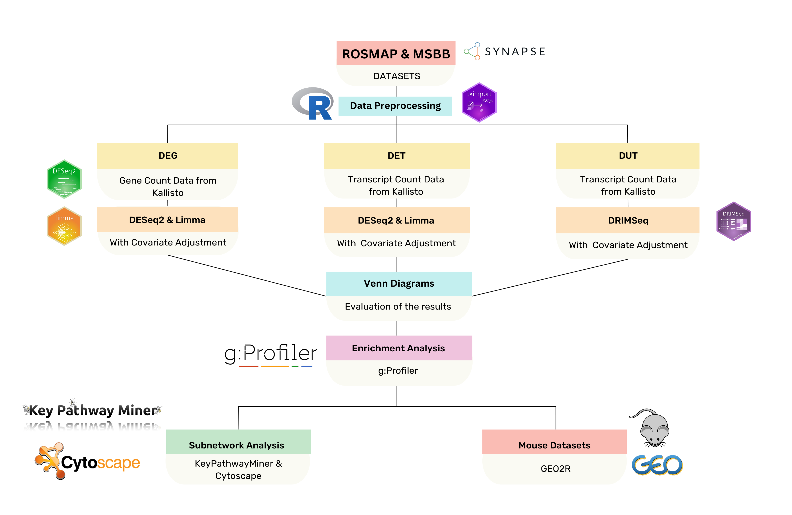

# Unravelling Synaptic and Metabolic Mechanisms of Cognitive Resilience in Asymptomatic Alzheimer’s Disease Across Two Alzheimer’s Disease Cohorts

<h2 align="center">**Abstract**</h2>

Asymptomatic Alzheimer’s disease (AsymAD), characterized by Alzheimer's disease (AD) pathology in cognitively normal individuals, represents a preclinical stage of AD and offers great potential for early diagnosis and intervention. This study aimed to identify molecular signatures associated with AsymAD and to discover new biomarker candidates. Two different RNA-seq datasets, Religious Orders Study/Memory and Aging Project (ROSMAP) and Mount Sinai Brain Bank (MSBB), were analysed. Individuals in the datasets were grouped into AD and AsymAD based on clinical and neuropathological criteria. Differentially expressed genes (DEGs), differentially expressed transcripts (DETs), and differentially used transcripts (DUTs) were identified between these groups. Significant genes from these three analyses were mapped onto the human protein–protein interaction (PPI) network using the KeyPathwayMiner tool to uncover subnetworks associated with AsymAD. Results were interpreted with enrichment analysis and compared with AD-related and learning-memory-cognition-related gene lists to identify biomarker candidate genes. Additionally, an extra validation step was performed using a mouse dataset. This study presents a comprehensive analysis of the molecular mechanisms of AsymAD with an innovative approach that goes beyond DEGs, incorporating transcript isoform analysis and subnetwork exploration. 

A flowchart below summarises the analyses and methods used in this study.

Due to large file sizes, most of the data files are not provided here. Instead, the title and a brief description of each file included in this repository are provided below.

---

## 📁 Kallisto
Contains the code for pseudo-alignment of preprocessed fastq files to the GRCh38 human reference transcriptome (from [GENCODE](https://www.gencodegenes.org)) using **Kallisto** (v0.46.1).

---

## 📁 Differential_Analyses
Includes the code for **DEG**, **DET**, and **DUT** analyses.  
- Expression quantification at both the gene and transcript level was performed using **tximport** (v1.30.0).  
- Contains separate scripts for DEG, DET, and DUT analysis.

---

## 📁 Figures

### **Comparisons**
- Contains code for plotting the comparison of significant genes/transcripts from DEG, DET, and DUT analyses across both datasets.  
*(Note: Large plot files (tiff) are not included here due to GitHub's file size limit.)*

### **Dot_Plots**
- Contains scripts for dot plots showing selected enrichment terms for ROSMAP and MSBB separately, based on combined significant genes from DEG, DET, and DUT analyses.  
*(Note: Large plot files (tiff) are not included here due to GitHub's file size limit.)*

### **Grouping&Scoring**
- Genes were scored:  
  - **Score 1**: Present in only one analysis (DEG, DET, or DUT)  
  - **Score 2**: Present in two analyses  
  - **Score 3**: Present in all three analyses  
- Genes were grouped into 9 categories (possible combinations) and the number of genes in each group was calculated.  
- Contains scripts of these group distributions.  
*(Note: Large plot files (tiff) are not included here due to GitHub's file size limit.)*

### **Box_Plots**
- Contains scripts for creating box plots for selected genes in DEG, DET, and DUT results.

---

## 📁 KPM_230
- Contains the code for subnetwork analysis using **KeyPathwayMiner** (v4.0) on the human PPI network (BioGRID Release 4.4.236, human-human interactions) to identify subnetworks involving scored candidate genes.
- **Attributes** folder contains group assignment scripts for visualisation purposes.

---

## 📁 Mouse_Analysis
- Analyzes interactions between important genes from `genelist_185` and differentially expressed mouse genes from the `target_genes` list using the PPI data.
- Reports the number of interactions and the number of unique interacting genes.

---
